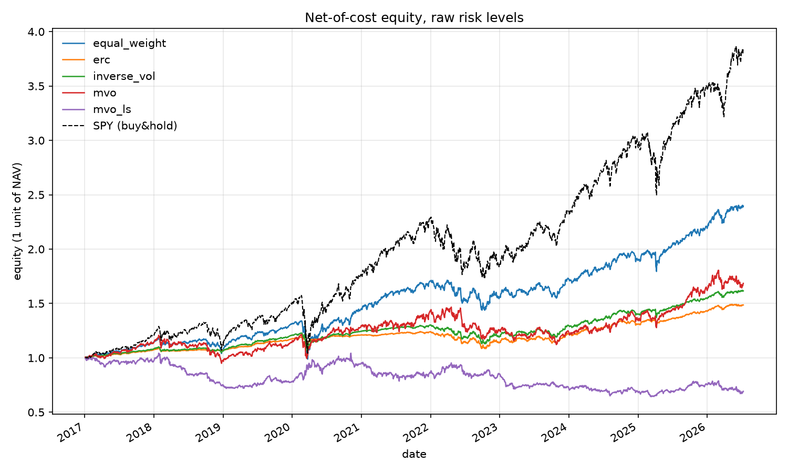
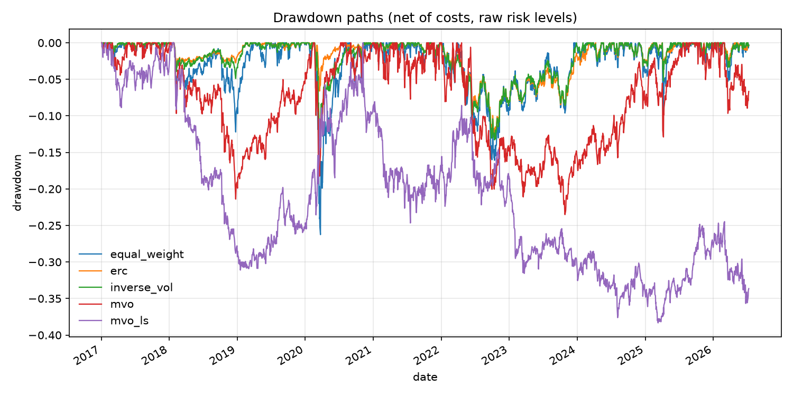
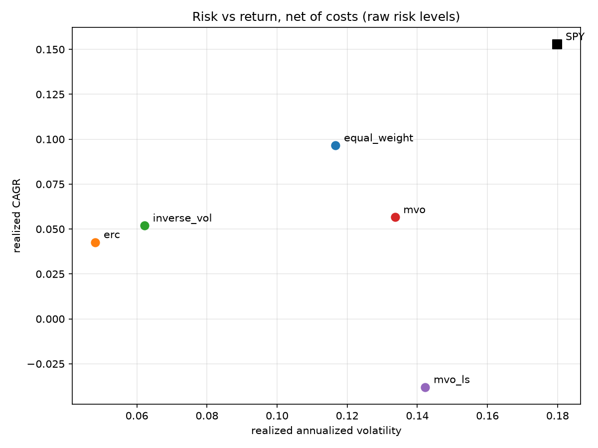
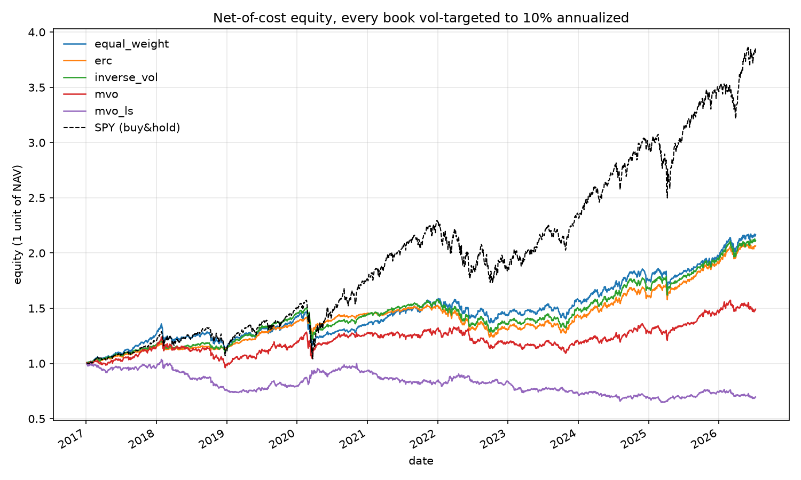
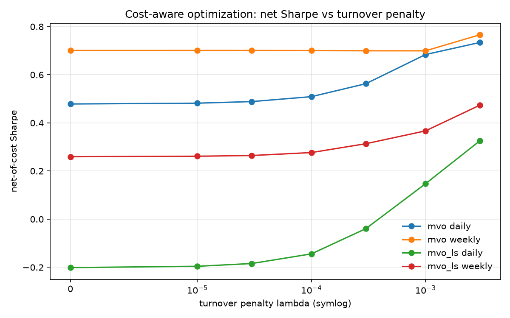
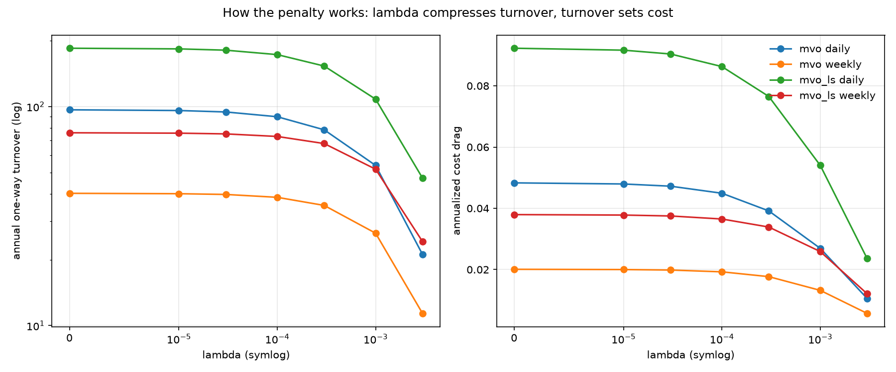
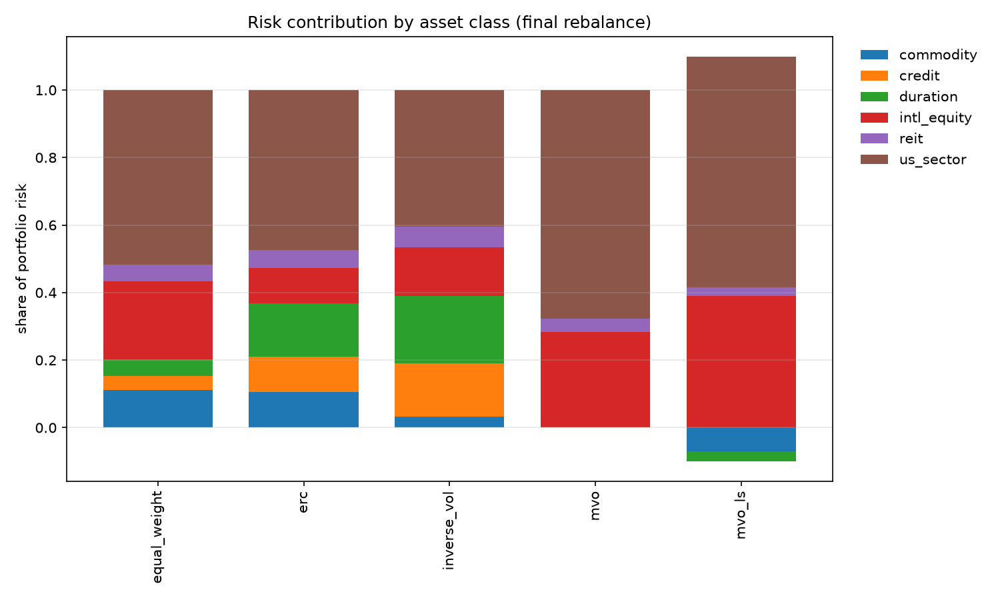
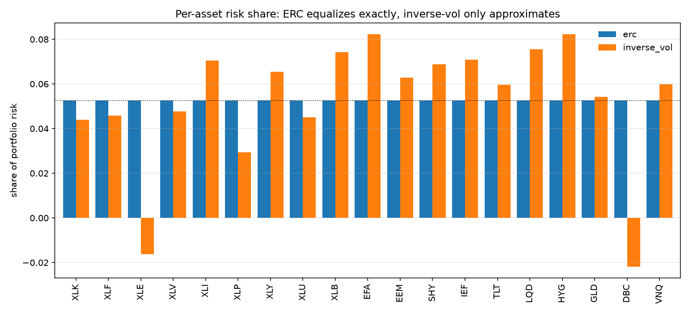
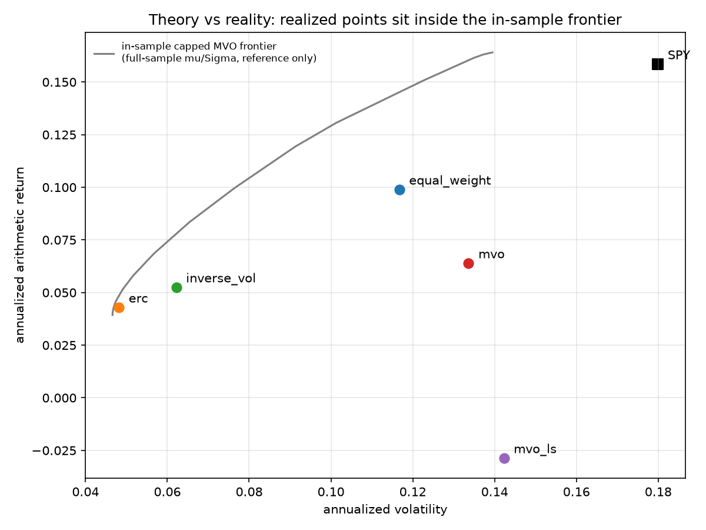

# portlab — Multi-Signal Portfolio Construction Lab

[](https://github.com/0liu/portfolio-lab/actions/workflows/ci.yml)

A daily-rebalancing, long-short-capable, multi-signal portfolio construction platform on cross-asset ETFs, with a walk-forward backtest engine and risk attribution.

## Scope

Layers / Features for a research-oriented portfolio construction lab:

- **Signals** — Multi-horizon time-series momentum, cross-sectional momentum, and short-term reversal, combined into an expected-return proxy under a strict point-in-time rule.
- **Estimation** — EWMA covariance and Ledoit-Wolf constant-correlation shrinkage implemented from the paper, validated against an independent reference.
- **Construction** — Equal-weight, inverse-volatility, ERC, long-only MVO, and long-short MVO behind one interface, with transaction-cost-aware optimization (L1 turnover penalty) and a volatility-targeting overlay.
- **Backtest** — Daily walk-forward engine with transaction costs, configurable rebalance frequency, drift-aware turnover, and a no-trade band.
- **Attribution** — MCR/CCR risk decomposition, per-optimizer performance comparison, and a turnover-penalty sweep as the headline cost study.

## Quickstart

```bash
uv sync --dev
make check
```

Zero credentials required — a split/dividend-adjusted daily-bars dataset from 2016-01 to 2026-07 downloaded from Alpaca is committed under `data/ohlcv/`.

This is a research library rather than an application, so there is no single `main`.

**Three entry points**:

1. Regenerate every exhibit from the committed cache

   ```bash
   uv run --extra exhibits python scripts/make_exhibits.py
   ```

   Useful flags: `--quick` (small lambda grid, weekly sweep only), `--output DIR`.

2. Interactive research — the primary use. Walked through end to end in the [research notebook](notebooks/research_walkthrough.ipynb) (`uv sync --extra notebook` for a kernel).

   ```python
   from portlab.attribution import comparison_table
   from portlab.config import Config
   from portlab.data import load_universe_bars
   from portlab.engine import run_all_optimizers
   from portlab.preprocessing import close_panel
   from portlab.universe import optimized_tickers

   closes = close_panel(load_universe_bars(tickers=optimized_tickers()))
   results = run_all_optimizers(closes, Config())
   print(comparison_table(results).round(3))
   ```
3. To refresh data from source instead: copy `.env.example` to `.env`, add free Alpaca API keys, then:

   ```bash
   uv run --extra refresh python -m portlab.data --refresh
   ```

## Documentation

- **[docs/methodology.md](docs/methodology.md)** — the derivations: the point-in-time contract,
  Ledoit-Wolf shrinkage worked through from the paper, the ERC gradient, and the engine's timeline
  and accounting identities.
- **[notebooks/research_walkthrough.ipynb](notebooks/research_walkthrough.ipynb)** — the library
  used interactively: the signals taken apart layer by layer, a single rebalance opened up, and
  three experiments the exhibits do not cover.
- **[docs/exhibits/](docs/exhibits/)** — every table and figure, each with the CSV behind it.

## Results

The following results are backtested over 19 cross-asset ETFs, from 2017-01 through 2026-07 (2,391 trading days after a one-year warm-up), 5 bps per side, daily rebalancing, all figures net of costs. Every table and figure below regenerates from the committed cache data into [docs/exhibits/](docs/exhibits/).

### Optimizer comparison at native risk levels

|              |  CAGR | Ann vol | Sharpe | Sortino | Calmar | Max drawdown | Ann turnover | Cost drag |  Beta |
|--------------|------:|--------:|-------:|--------:|-------:|-------------:|-------------:|----------:|------:|
| equal_weight | 9.65% |  11.67% |  0.848 |   1.181 |  0.368 |      -26.25% |          1.6 |     0.08% | 0.601 |
| erc          | 4.26% |   4.81% |  0.891 |   1.265 |  0.337 |      -12.64% |          2.4 |     0.12% | 0.187 |
| inverse_vol  | 5.19% |   6.22% |  0.844 |   1.172 |  0.387 |      -13.40% |          1.7 |     0.09% | 0.293 |
| mvo          | 5.65% |  13.36% |  0.479 |   0.651 |  0.240 |      -23.52% |         96.6 |     4.83% | 0.537 |
| mvo_ls       |-3.80% |  14.23% | -0.201 |  -0.272 | -0.099 |      -38.33% |        184.5 |     9.23% | 0.223 |

Three of these five never look at expected returns at all: equal weight, inverse-vol, and ERC allocate from risk structure alone. Only the MVO family consumes the signal layer's μ, which turns out to matter more than any other difference between them.



Among the four books not destroyed by trading costs, the ordering of final NAV is exactly the ordering of beta (market exposure): equal_weight (0.601) > mvo (0.537) > inverse_vol (0.293) > erc (0.187). ERC finishes last on wealth while running less than **1/3 of equal weight's market exposure** and **41% of its volatility**.



The drawdown paths separate the books by shape, not just depth. ERC and inverse-vol stay **above -14%** for the entire decade and recover within weeks. Equal weight's -26% is a single vertical COVID crash followed by a fast recovery. MVO grinds through repeated -20% episodes. MVO-LS enters a drawdown in mid-2022 and never leaves it, a **cost bleed** rather than a market event.



The scatter makes the dominance relations explicit: MVO sits below and to the right of equal weight, taking more risk for less return, and MVO-LS is the only book in negative territory.

### The same books at a common risk level

Scaling every portfolio to a 10% annualized volatility target removes the beta confound and compares construction quality directly:

|              |  CAGR | Ann vol | Sharpe | Sortino | Calmar | Max drawdown | Ann turnover | Cost drag |  Beta |
|--------------|------:|--------:|-------:|--------:|-------:|-------------:|-------------:|----------:|------:|
| equal_weight | 8.48% |  10.36% |  0.838 |   1.136 |  0.408 |      -20.79% |          2.7 |     0.13% | 0.493 |
| erc          | 7.93% |   8.06% |  0.988 |   1.377 |  0.418 |      -19.00% |          5.0 |     0.25% | 0.321 |
| inverse_vol  | 8.20% |   9.28% |  0.896 |   1.223 |  0.436 |      -18.82% |          3.7 |     0.19% | 0.425 |
| mvo          | 4.30% |  11.05% |  0.437 |   0.584 |  0.191 |      -22.49% |         93.4 |     4.67% | 0.439 |
| mvo_ls       |-3.73% |  11.17% | -0.284 |  -0.382 | -0.099 |      -37.64% |        168.7 |     8.44% | 0.181 |



The CAGR spread among the three signal-free books (equal weight, ERC, inverse vol) collapses from 9.65 / 4.26 / 5.19 to 8.48 / 7.93 / 8.20 — nearly all of the raw gap was risk level, not skill. What survives the normalization is **ERC's lead in Sharpe ratio** (0.988 against 0.896) and Sortino ratio (1.377 against 1.223).

Two mechanical caveats, both visible in the table. Realized volatility does not hit the 10% target: the overlay scales by *predicted* volatility from the EWMA covariance, and *realized* volatility outcomes range from 8.06% (erc) to 11.17% (mvo_ls). The risk model over-predicts for the most diversified book and under-predicts for the leveraged ones. ERC additionally cannot reach the target at all: lifting a 4.81% volatility book to 10% requires 2.08x leverage, above the 2.0 gross exposure cap ceiling.

### Cost-aware optimization



| optimizer | freq   | net Sharpe, λ=0 | net Sharpe, λ=3e-3 |     Δ |
|-----------|--------|----------------:|-------------------:|------:|
| mvo       | weekly |           0.701 |              0.766 | +0.07 |
| mvo       | daily  |           0.479 |              0.734 | +0.26 |
| mvo_ls    | weekly |           0.260 |              0.474 | +0.21 |
| mvo_ls    | daily  |          -0.201 |             +0.326 | +0.53 |

The daily legs gain the most from cost-aware optimization, since they had the most turnover to give back. The gain is large enough to reorder the rebalance frequency comparison: **a cost-aware daily book (0.734) beats a cost-unaware weekly one (0.701)**. Rebalancing less often is a blunt way to cut costs: it slows down every trade, including the ones worth making. The penalty is targeted — the optimizer skips the trades that don't cover their own cost and keeps the ones that do. All four curves are still rising at the largest penalty tested, so the best (cost-optimal) λ is somewhere past the right edge of this chart.

Higher λ doesn't have to mean higher Sharpe, and `mvo-weekly` proves it: its Sharpe barely moves (0.701 → 0.699) all the way from λ = 0 to λ = 1e-3, then jumps to 0.766 at 3e-3. What is guaranteed is that **turnover falls monotonically in λ**, which holds exactly on all four legs, and it's one of the optimizer contract tests. Sharpe depends on which trades got cut, not just how many, so it can wander even while turnover marches down.



The mechanism is turnover, and only turnover, i.e. trading less. Across the grid the penalty cuts annual one-way turnover by 3.1x to 4.6x — mvo_ls daily 184.5 → 47.2, mvo daily 96.6 → 21.1 — and cost drag falls in exact proportion (9.23% → 2.36%, 4.83% → 1.06%), because cost is turnover times 5 bps cost rate. Notice the daily and weekly curves nearly meet at high λ: a sufficiently penalized daily book *chooses* to trade at roughly weekly intensity. It arrives there on its own (endogenous) and per asset, rather than by being told to only trade on Fridays.

### Risk decomposition



At the final rebalance, MVO puts 96.19% of its risk in equities (67.83% US sectors plus 28.36% international) and essentially nothing in duration, credit, or commodities — 0.00%, 0.00%, and 0.02% respectively. That concentration is produced by estimated expected returns, not by design. MVO-LS goes further still, to 107.46% equity risk: its short positions in commodities (−6.95%) and duration (−2.95%) act as hedges, contributing negative risk, so the long side must carry more than the whole. The three signal-free books spread risk across all six classes — equal weight 74.94% in equities, ERC 57.89%, inverse-vol 55.06%, with inverse-vol carrying the most duration and credit risk (19.94% and 15.77%) and ERC the most balanced profile.



Per asset, ERC pins every share to **exactly 1/19 = 5.26%**. Inverse-vol ranges from **-2.18% (DBC) to +8.22% (HYG, EFA)**. It overweights low-volatility assets without seeing that they are correlated with each other, so the duration and credit sleeves collectively carry far more than their share: LQD +2.29 pp over equal, HYG +2.95 pp, IEF +1.83 pp, while the two genuinely diversifying assets end up with negative risk contributions: XLE (−1.62%) and DBC (−2.18%), each roughly 7 pp below where ERC puts them. That correlation information is the entire difference between the two rules, and exploiting it costs ERC ~30% more turnover.

### Theory versus realization



The grey curve is the efficient frontier computed from the whole sample's returns and covariance, the best risk-return tradeoffs available *if you had known the future*, so it isn't tradable. Each dot is what an optimizer actually earned. The vertical distance between a dot and the curve is the price of having to estimate instead of know:

| book         | reads μ? | realized vol | earned | frontier offered | shortfall |
|--------------|----------|-------------:|-------:|-----------------:|----------:|
| erc          | no       |        4.81% |  4.29% |            4.84% |   0.55 pp |
| inverse_vol  | no       |        6.22% |  5.25% |            7.79% |   2.54 pp |
| equal_weight | no       |       11.67% |  9.89% |           14.51% |   4.62 pp |
| mvo          | yes      |       13.36% |  6.40% |           16.03% |   9.64 pp |
| mvo_ls       | yes      |       14.23% | -2.86% |   off the curve  |         — |

*Returns here are annualized arithmetic means, to match the frontier's axis. The tables above report geometric CAGR, hence the small differences.*

The shortfall grows down the table, and the two books that read expected returns are at the bottom. Some of that is because the frontier steepens as volatility rises, so a riskier book has further to fall. But not all of it: MVO gives up 9.64 pp against equal weight's 4.62 pp at a similar risk level (13.36% vs 11.67% volatility), more than twice the shortfall over a 1.7-point difference in volatility.

MVO-LS doesn't appear in the last column because it ran off the end of the curve. A long-only book that is capped at 25% per asset and fully invested can't get riskier than 13.95% volatility, which is where the frontier stops. MVO-LS reached 14.23%, for which shorting and 2x gross exposure let it take risk no long-only portfolio could, and it earned *negative* 2.86% at that risk level.

In summary the three books that do not predict returns land closest to a frontier they weren't even aiming at, while the two that aim straight at it miss by the widest margins.

### Summary of the Results

**How the optimizers compare**

- **ERC is the best risk-adjusted book, but it does not sweep the table.** It wins Sharpe (0.891), Sortino (1.265), volatility (4.81%), and max drawdown (-12.64%) at native risk levels, and extends the Sharpe/Sortino lead once every book is vol-targeted (0.988 / 1.377). It loses CAGR to equal weight and loses Calmar to inverse-vol in both tables (0.337 vs 0.387 raw, 0.418 vs 0.436 targeted). **Return per unit of drawdown** is the one risk-adjusted metric where its conservatism costs more than it saves.
- **Equal weight wins absolute return and nothing else.** The highest CAGR (9.65%) comes with the highest beta (0.601), the highest volatility among the long-only books, and the deepest non-MVO drawdown (-26.25%). It is the highest-exposure portfolio here, not the best-constructed one.
- **Inverse-vol is the value pick.** Within 0.05 Sharpe of ERC, better Calmar in both tables, and ~30% less turnover, from a closed-form rule instead of an optimizer.
- **The MVO family loses on every risk-adjusted and cost metric**, in both tables: Sharpe, Sortino, Calmar, drawdown, turnover, cost. It does out-earn ERC and inverse-vol on raw CAGR (5.65% vs 4.26% and 5.19%), but only by running 13.36% volatility to do it, and that edge disappears entirely once every book is vol-targeted (4.30%, the lowest of the long-only books). Long-short MVO is negative on everything.
- **Vol targeting helps the risk-parity books and hurts the rest.** ERC 0.891 → 0.988 and inverse-vol 0.844 → 0.896, while equal weight (0.848 → 0.838), mvo (0.479 → 0.437) and mvo_ls (-0.201 → -0.284) all get slightly worse.

**What the backtest exposes**

- **Costs are a first-order term at daily frequency.** The cost-unaware daily MVO-LS book gives back 9.23% a year on 184.5x turnover and is net-negative purely from trading. The λ penalty compresses turnover 3.9x and flips the sign (-0.201 → +0.326). Cost-awareness is not a refinement; it decides survival and dominates the cruder lever of simply trading less often.
- **Estimation error beats optimization.** ERC, which never reads expected returns, earns Sharpe 0.891 against capped long-only MVO's 0.479 on identical inputs, and the frontier gaps widen precisely with reliance on estimated μ (0.55 pp for ERC against 9.64 pp for MVO). Optimizing against noisy inputs is worse than not optimizing at all.
- **ERC's exactness is not free.** Inverse-vol approximates it closely enough to be nearly indistinguishable on performance, at ~30% less turnover. What ERC uniquely delivers is **exactness**: risk shares pinned to 1/19, including the negative contributions inverse-vol cannot see.
- **Volatility targeting is not free either.** The overlay adds its own rescaling trades: turnover roughly doubles for the low-turnover books (erc 2.4 → 5.0). It also misses its target (8.06%-11.17% realized against 10%) and cannot lift ERC to the target at all without breaching the gross cap.
- **Headline caveat: nothing beats SPY's terminal wealth in this sample.** 2017-2026 was a US-equity decade: SPY compounded 3.85x, a 15.3% CAGR at 18.0% volatility, and any cross-asset diversified book trails it. The payoff appears in the drawdown panel rather than the equity panel: SPY's worst peak-to-trough was −33.79%, against ERC's −12.64% at a beta of 0.187. Diversification is a risk trade, and this sample prices it honestly.

## Methodology & Key Decisions

Full derivations are in [docs/methodology.md](docs/methodology.md). It covers Ledoit-Wolf shrinkage, the ERC gradient, engine timeline and accounting identities, etc. The choices that shape the results:

| Question | Decision |
|---|---|
| Look-ahead defense | PIT shifts baked into each signal's definition, not deferred downstream; guarded end-to-end by a tripwire test |
| Signal combine | Differential: TS momentum keeps its absolute level channel; cross-sectional momentum and reversal are mean-zero relative overlays |
| Expected returns | `mu = composite_score * sigma_daily`, a directional proxy with arbitrary scale, not a calibrated forecast |
| Covariance | EWMA (halflife 63d) by default; Ledoit-Wolf constant-correlation as a config switch. They are alternatives, not composable |
| Risk aversion | `gamma = 100` reflects daily-frequency units (mu ~ 1e-2, Sigma ~ 1e-4), not a miscalibration |
| Turnover penalty | `lambda = 0` by default — the cost-unaware control arm of the headline exhibit |
| Optimizer contracts | Sum-to-1, caps, gross/net bands, and equal risk contributions re-verified after every solve; the solver's success flag is a self-report |
| Turnover measurement | Against the drifted book, and against post-band held weights, so cost equals real turnover x rate exactly |
| Costs | 5 bps per side on traded notional, configurable |
| Vol targeting | Scales gross exposure to 10% annualized, reusing the gross cap as the leverage ceiling |
| Universe | 19 currently-liquid cross-asset ETFs; SPY/AGG are reference curves only, never optimized |

All research parameters live in `portlab/config.py` as frozen dataclasses.

## Testing

```bash
make check      # ruff + pytest, no network, no credentials
```

204 tests in six groups.

- **Signal correctness**
  Hand-computed values against the frozen spec, plus look-ahead tripwires: perturbing the day-k close must leave every signal at or before day k bit-identical.
- **Estimator validation**
  Sample covariance matched exactly against sklearn and numpy. The vectorized Ledoit-Wolf matched to 1e-12 against a literal loop transcription of the paper; symmetry, PSD, and diagonal-preservation properties; shrinkage intensity vanishing under a deliberately misspecified target.
- **Optimizer contracts**
  Full investment, position caps, gross/net bands, ERC equal contributions, the analytic ERC special cases, the mu-scale/risk-aversion tradeoff, and the monotone lambda-up-turnover-down relation.
- **Engine mechanics**
  Rebalance schedules, warm-up boundaries, no-trade band behavior, vol-target wiring, and end-to-end PIT tripwires through the full backtest.
- **Accounting identities**
  Weight conservation, cost equals turnover times rate, a hand-computed two-asset case, and an independent pandas replay of the entire ledger cross-checked against the engine's numpy path.
- **Attribution and reporting**
  Hand-computed performance statistics, the Euler risk-decomposition identities, beta against a known linear relation, and a cross-module check that ERC's own weights decompose to equal risk shares.

## Repo Layout

```
portlab/
  config.py         Frozen research parameters: signals, estimation, construction, engine, costs
  universe.py       19 optimized ETFs across 6 asset classes + SPY/AGG references
  data.py           Alpaca daily bars downloader and committed parquet cache loader
  preprocessing.py  Trading calendar, aligned close panel, daily returns
  signals.py        TS momentum, cross-sectional momentum, reversal, differential combine
  estimation.py     EWMA std/covariance, Ledoit-Wolf constant-correlation shrinkage
  construction.py   Five optimizers behind one optimize() interface, vol-target overlay
  engine.py         Daily walk-forward backtest, drift accounting, no-trade band, costs
  attribution.py    Performance stats, MCR/CCR decomposition, beta, lambda sweep, frontier
scripts/
  make_exhibits.py  Regenerates every table and figure from the committed cache
notebooks/
  research_walkthrough.ipynb  The library used interactively, end to end
tests/              Signals, estimation, construction, engine, accounting, attribution tests
data/ohlcv/         Committed daily-bars parquet cache, one file per ticker
docs/
  methodology.md    Derivations, conventions, and design rationale
  exhibits/         Generated tables and figures from the committed full sample
```

## Limitations

- **Execution is idealized**: trades fill at the same close the signal saw, no implementation lag, overnight gap, or slippage. Costs are linear (5 bps), with no market impact and no notion of account size.
- **One sample path**: a single decade, dominated by a US-equity bull market and a fixed, hindsight-selected universe of currently-liquid ETFs. Survivorship at the universe level.
- **No hyperparameter search was run**: every parameter is a conventional default frozen a priori. Results are not overfit — and also not tuned.
- **Sharpe and Sortino use rf = 0.** US cash yielded 4-5% through the back half of the sample, so every risk-adjusted figure here is flattered; ERC's 4.26% native CAGR is roughly cash-equivalent over that stretch. The vol-targeted table is the fairer read, and a proper excess-return treatment would reorder the low-volatility books.
- **`run_backtest` cannot take an externally supplied μ.** It always builds expected returns internally from `cfg.signals`, and no config setting can switch a single component off. Ablating one signal therefore needs a runtime patch rather than a config variant — a missing argument, not a missing capability, and the [notebook](notebooks/research_walkthrough.ipynb) shows the two-line fix.
- **The signal layer is only exercised through the MVO family**. Equal weight, inverse-vol, and ERC ignore μ entirely, so three of the five optimizers say nothing about signal quality — and the two that do consume μ are the cost-damaged ones. These results do not cleanly separate signal quality from optimizer sensitivity to estimation error. The notebook pushes on this: ablating each component shows that dropping the short-term reversal signal improves net Sharpe by 0.076 while cutting turnover 62%, so as seen through the MVO objective the composite carries a component that only pays costs — though whether the signal is uninformative or merely unusable by this optimizer would need a test that bypasses construction entirely.
- **The λ grid does not bracket the optimum**: net Sharpe is still rising at the largest penalty tested (3e-3) on all four legs, so the cost-optimal penalty lies outside the sweep and the reported gains are a lower bound.
- **Vol targeting is approximate**: the overlay scales by predicted volatility from the EWMA model, and realized volatility lands between 8.06% and 11.17% against a 10% target. For ERC the 2.0 gross cap binds before the target is reachable.
- **Beta is a single full-sample estimate** against SPY, with no rolling window, no up/down decomposition, and no separation of market exposure from the other factors driving these asset classes.
- **The efficient frontier is in-sample**: built from full-sample moments and not achievable in real time. It bounds the estimation-error gap from a reference the backtest could never have traded, and it does not extend to MVO-LS's realized volatility.
- **Ledoit-Wolf and EWMA don't compose**: the shrinkage intensity is derived under i.i.d. equal weighting, so the config offers them as alternatives, not a combination. Measured in the [notebook](notebooks/research_walkthrough.ipynb), that restriction turns out to cost nothing: on the minimum-variance book EWMA matches or beats the shrinkage estimator at every window length tested, so the estimator that cannot be combined with shrinkage is the one that wins anyway. At daily frequency the binding constraint is non-stationarity, not estimation noise.
- **ERC numerical precision** on the real 19-asset covariance is ~5e-5 in the worst regime (late 2020), driven by the collinear duration and credit sleeves; the acceptance tolerance is set at 1e-4 from measurement. Hierarchical risk parity would sidestep the ill-conditioning.

## License

MIT
